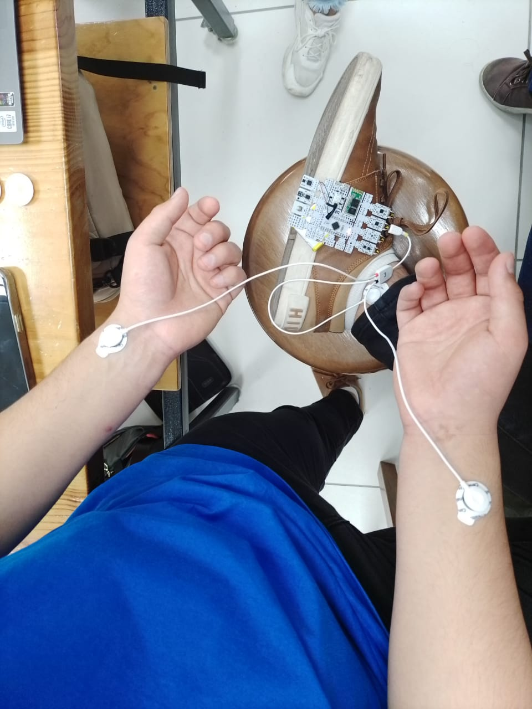
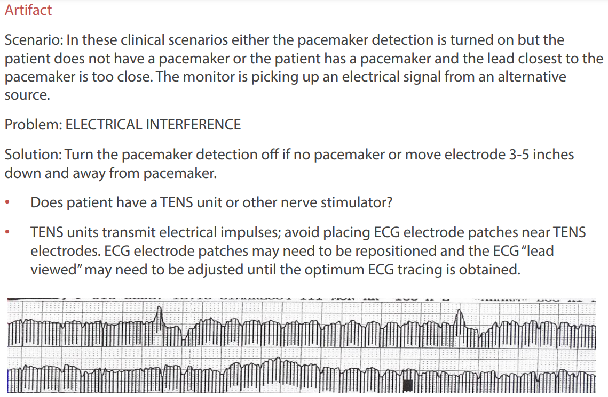

<html>
  <head>
    <meta content="text/html; charset=UTF-8" http-equiv="content-type" />
  </head>
  <body class="c23 doc-content">
    # **LABORATORIO 4: – Uso de BiTalino para ECG**

# **Tabla de contenidos**
1. [Introducción](#id0)
2. [Objetivos](#id1)
3. [Materiales y equipos](#id2)
4. [¿Que es un ECG?](#id3)
5. [Procedimiento](#id4)
6. [Resultados](#id5)
7. [Discucion](#id6)
8. [Conclusiones](#id7)
9. [Referencias](#id8).

    <h2 class="c17">Introducci&oacute;n:</h2>
    

    

      El estudio de se&ntilde;ales biom&eacute;dicas, como las se&ntilde;ales
        electromiogr&aacute;ficas (EMG) y electrocardiogr&aacute;ficas (ECG),
        desempe&ntilde;a un papel fundamental en la comprensi&oacute;n de la
        actividad muscular y card&iacute;aca, respectivamente. En esta
        pr&aacute;ctica de laboratorio, nuestro objetivo principal fue adquirir
        y analizar estas se&ntilde;ales utilizando el sistema BiTalino y el
        software OpenSignals (r)evolution. Para lograr esto, configuramos
        adecuadamente el equipo, realizamos conexiones con electrodos en el
        cuerpo de nuestros compa&ntilde;eros estudiantes y registramos las
        se&ntilde;ales EMG y ECG en diferentes condiciones.
    

    

    <h2 class="c17">Objetivos espec&iacute;ficos:</h2>
    

    

      1. Adquirir se&ntilde;ales biom&eacute;dicas de EMG y ECG: Durante la
        pr&aacute;ctica, adquirimos se&ntilde;ales EMG para estudiar la
        actividad muscular y se&ntilde;ales ECG para analizar la actividad
        el&eacute;ctrica del coraz&oacute;n. Estas se&ntilde;ales nos
        proporcionaron informaci&oacute;n valiosa sobre la actividad
        fisiol&oacute;gica de los sujetos.
    

    

    

      2. Hacer una correcta configuraci&oacute;n de BiTalino: La
        configuraci&oacute;n adecuada del dispositivo BiTalino es esencial para
        garantizar la calidad y precisi&oacute;n de las se&ntilde;ales
        registradas. Esto incluy&oacute; la selecci&oacute;n de los canales
        adecuados, la calibraci&oacute;n y la configuraci&oacute;n de la
        frecuencia de muestreo.
    

    

    

      3. Extraer la informaci&oacute;n de las se&ntilde;ales EMG y ECG del
        software OpenSignals (r)evolution: Utilizamos el software OpenSignals
        (r)evolution para adquirir y visualizar las se&ntilde;ales en tiempo
        real. Adem&aacute;s, este software nos permiti&oacute; grabar los datos
        para su posterior an&aacute;lisis y procesamiento.
    

    

    

      4. Fotos de conexi&oacute;n usada (Electrodos-cuerpo, BiTalino-cables):
        Documentamos visualmente las conexiones entre los electrodos y el cuerpo
        de los sujetos, as&iacute; como la conexi&oacute;n de los cables al
        dispositivo BiTalino para tener un registro completo de nuestra
        configuraci&oacute;n experimental.
    

    

    

      5. Video de se&ntilde;al en silencio el&eacute;ctrico o reposo:
        Grabamos un video que mostraba las conexiones de los electrodos al
        cuerpo de los sujetos en estado de reposo, sin actividad muscular
        significativa. Este video servir&aacute; como referencia visual para la
        condici&oacute;n de referencia.
    

    

    

      6. Ploteo de la se&ntilde;al en OpenSignals: Despu&eacute;s de adquirir
        los datos, ploteamos las se&ntilde;ales EMG y ECG en tiempo real en el
        software OpenSignals (r)evolution para observar la actividad muscular y
        card&iacute;aca en funci&oacute;n del tiempo.
    

    

    

      7. Resumen y explicaci&oacute;n de la se&ntilde;al ploteada: Analizamos
        las se&ntilde;ales registradas, identificamos los patrones y
        caracter&iacute;sticas relevantes en las se&ntilde;ales EMG y ECG y
        proporcionamos una explicaci&oacute;n detallada de lo observado.
    

    

    

      8. El archivo de los datos de la se&ntilde;al ploteada: Guardamos los
        datos registrados en un archivo para su posterior an&aacute;lisis y
        procesamiento. Estos datos se utilizar&aacute;n para investigaciones
        posteriores y an&aacute;lisis m&aacute;s detallados.
    

    

    

      9. Ploteo de la se&ntilde;al en Python: Adem&aacute;s de utilizar el
        software OpenSignals, tambi&eacute;n ploteamos las se&ntilde;ales
        biom&eacute;dicas utilizando Python para aprender c&oacute;mo procesar y
        analizar los datos de manera m&aacute;s personalizada.
    

    

    

      En este informe de laboratorio, presentaremos los resultados y
        an&aacute;lisis obtenidos de acuerdo con los objetivos
        espec&iacute;ficos mencionados anteriormente. El estudio de
        se&ntilde;ales biom&eacute;dicas es esencial en la investigaci&oacute;n
        m&eacute;dica y la tecnolog&iacute;a de la salud, y esta pr&aacute;ctica
        nos proporcion&oacute; una valiosa experiencia en la adquisici&oacute;n
        y an&aacute;lisis de estas se&ntilde;ales.
    

    

    <h2 class="c17">Materiales y equipo:</h2>
    

    
    <table class="c36">
      <tr class="c29">
        <td class="c34" colspan="2" rowspan="1">
          
Equipo | Materiales

        </td>
        <td class="c7" colspan="1" rowspan="2">
          
Cantidad

        </td>
      </tr>
      <tr class="c29">
        <td class="c33" colspan="1" rowspan="1">
          
Modelo

        </td>
        <td class="c27" colspan="1" rowspan="1">
          
Descripci&oacute;n

        </td>
      </tr>
      <tr class="c29">
        <td class="c33" colspan="1" rowspan="1">
          
( R )EVOLUTION

        </td>
        <td class="c27" colspan="1" rowspan="1">
          
Kit BITalino &nbsp;

        </td>
        <td class="c7" colspan="1" rowspan="1">
          
1

        </td>
      </tr>
      <tr class="c29">
        <td class="c33" colspan="1" rowspan="1">
          
-

        </td>
        <td class="c27" colspan="1" rowspan="1">
          
Laptop o PC 

        </td>
        <td class="c7" colspan="1" rowspan="1">
          
1

        </td>
      </tr>
      <tr class="c29">
        <td class="c33" colspan="1" rowspan="1">
          
-

        </td>
        <td class="c27" colspan="1" rowspan="1">
          
Parches de electrodos

        </td>
        <td class="c7" colspan="1" rowspan="1">
          
6

        </td>
      </tr>
      <tr class="c29">
        <td class="c33" colspan="1" rowspan="1">
          
Fluke Biomedical

        </td>
        <td class="c27" colspan="1" rowspan="1">
          

            ProSim&trade; 4 Vital Signs Simulator
          

        </td>
        <td class="c7" colspan="1" rowspan="1">
          
1

        </td>
      </tr>
    </table>
    

    

      Adicionalmente cabe mencionar que para el desarrollo del presente
        laboratorio nos basamos en los siguientes documentos:
    

    <ul class="c10 lst-kix_53ap384ualt-0 start">
      <li class="c13 li-bullet-0">
        Gu&iacute;as de pr&aacute;ctica cl&iacute;nica de la Sociedad
          Espa&ntilde;ola de Cardiolog&iacute;a en pruebas de esfuerzo [1]
      </li>
      <li class="c13 li-bullet-0">
        Protocolo del procedimiento de colocaci&oacute;n de derivaciones de
          ECG de Mindray [2]
      </li>
      <li class="c13 li-bullet-0">
        Gu&iacute;a de laboratorio para ECG BITalino (r)evolution [3]
      </li>
    </ul>
    

    <h2 class="c17">&iquest;Qu&eacute; es un ECG?</h2>
    

      Un electrocardiograma(ECG) es un procedimiento indoloro y no invasivo
        que ayuda a diagnosticar varios problemas card&iacute;acos usando las
        se&ntilde;ales el&eacute;ctricas que registra del coraz&oacute;n[4].
        Puede detectar &nbsp;afecciones como:
    

    

    <ul class="c10 lst-kix_bwajciisvt6j-0 start">
      <li class="c19 c25 li-bullet-0">Arritmia</li>
      <li class="c25 c19 li-bullet-0">
        Cardiomiopat&iacute;a
      </li>
      <li class="c25 c19 li-bullet-0">
        Enfermedad de las arterias coronarias
      </li>
      <li class="c25 c19 li-bullet-0">
        Ataque cardiaco
      </li>
      <li class="c25 c19 li-bullet-0">
        Insuficiencia cardiaca
      </li>
      <li class="c25 c19 li-bullet-0">
        Enfermedades de las v&aacute;lvulas del coraz&oacute;n
      </li>
      <li class="c25 c19 li-bullet-0">
        Defectos card&iacute;acos cong&eacute;nitos
      </li>
    </ul>
    <h2 class="c17">
      &iquest;Qu&eacute; se observa en un ECG?
    </h2>
    

      El electrocardiograma es un conjunto de ondas llamadas P, Q, R, S, T y
        U de acuerdo con el orden de aparici&oacute;n en el tiempo, en el
        laboratorio nos centraremos en 3 se&ntilde;ales:
    

    <ul class="c10 lst-kix_7p60wf74cab1-0 start">
      <li class="c13 li-bullet-0">
        Onda P: se inscribe como resultado de la activaci&oacute;n
          auricular.
      </li>
      <li class="c13 li-bullet-0">
        Arreglo Q, R y S: integran el complejo ventricular por la
          propagaci&oacute;n de la onda de excitaci&oacute;n a la musculatura de
          ambos ventr&iacute;culos y al tabique interventricular.
      </li>
      <li class="c13 li-bullet-0">
        Onda T: la expresi&oacute;n del restaurador proceso de
          repolarizaci&oacute;n[5]
      </li>
    </ul>
    

    

      
    

    

      Img.1 Gr&aacute;fica ECG explicada[6]
    

    

    

      Los equipos con los que se realiza el electrocardiograma vienen dotados
        de un selector de derivaciones, de modo que &eacute;stas se toman
        siempre en el mismo orden, se tienen 12 derivaciones seis derivaciones
        est&aacute;ndar y seis derivaciones precordiales, las seis precordiales
        son : V1, V2, V3, V4, V5 y V6.
    

    

    

      
    

    
Img.2 Ubicaci&oacute;n de derivaciones[7]

    

    <h2 class="c17">Procedimiento:</h2>
    <ol class="c10 lst-kix_mnifvcvxdhvy-0 start" start="1">
      <li class="c18 c37 li-bullet-0">
        Preparaci&oacute;n del paciente
      </li>
    </ol>
    

    

      Antes de hacer cualquier procedimiento de experimentaci&oacute;n es
        necesario preparar adecuadamente al paciente. Esta preparaci&oacute;n
        incluye:
      
    

    

    <ul class="c10 lst-kix_qkki3vljkzlv-0 start">
      <li class="c9 li-bullet-0">
        Comunicaci&oacute;n con el paciente: Explicar el procedimiento del
          ECG y asegurar que comprenda lo que se espera de &eacute;l.
        
      </li>
    </ul>
    

    <ul class="c10 lst-kix_qkki3vljkzlv-0">
      <li class="c9 li-bullet-0">
        Vestimenta adecuada: Verificar que el paciente lleve ropa que permita
          acceder a las &aacute;reas donde se colocar&aacute;n los electrodos.
        
      </li>
    </ul>
    

    <ul class="c10 lst-kix_qkki3vljkzlv-0">
      <li class="c9 li-bullet-0">
        Preparaci&oacute;n de la piel: Limpiar la piel del paciente en las
          &aacute;reas donde se colocar&aacute;n los electrodos.
      </li>
    </ul>
    

    

    <ul class="c10 lst-kix_qkki3vljkzlv-0">
      <li class="c9 li-bullet-0">
        Posici&oacute;n y estado del paciente: Indicar al paciente la
          posici&oacute;n en la que debe estar y solicitar que permanezca lo
          m&aacute;s relajado y tranquilo posible, ya que el movimiento y la
          ansiedad pueden afectar los resultados.
        
      </li>
    </ul>
    

    <ul class="c10 lst-kix_qkki3vljkzlv-0">
      <li class="c9 li-bullet-0">
        Duraci&oacute;n de la prueba: Informar al paciente sobre la
          duraci&oacute;n estimada de la prueba.
      </li>
    </ul>
    

    <ul class="c10 lst-kix_qkki3vljkzlv-0">
      <li class="c9 li-bullet-0">
        Paciente con implantes y accesorios met&aacute;licos: Verificar que
          el paciente no cuente con implantes met&aacute;licos, ni tampoco
          accesorios met&aacute;licos que se encuentren cerca de los electrodos
          porque al realizar el ECG, estos pueden interferir con el equipo.
        
      </li>
    </ul>
    

    <ol class="c10 lst-kix_mnifvcvxdhvy-0" start="2">
      <li class="c13 li-bullet-0">
        Realizaci&oacute;n de la prueba
      </li>
    </ol>
    <ol class="c10 lst-kix_mnifvcvxdhvy-1 start" start="1">
      <li class="c17 c21 li-bullet-0">Protocolo</li>
    </ol>
    

    
    <table class="c12">
      <tr class="c14">
        <td class="c20" colspan="1" rowspan="1">
          
N&deg; de orden

        </td>
        <td class="c32" colspan="1" rowspan="1">
          
Actividad

        </td>
      </tr>
      <tr class="c14">
        <td class="c20" colspan="1" rowspan="1">
          
1

        </td>
        <td class="c32" colspan="1" rowspan="1">
          

            Preparaci&oacute;n y consentimiento del paciente
          

        </td>
      </tr>
      <tr class="c14">
        <td class="c20" colspan="1" rowspan="1">
          
2

        </td>
        <td class="c32" colspan="1" rowspan="1">
          

            Colocaci&oacute;n de los electrodos
          

        </td>
      </tr>
      <tr class="c14">
        <td class="c20" colspan="1" rowspan="1">
          
3

        </td>
        <td class="c32" colspan="1" rowspan="1">
          

            Adquisici&oacute;n de datos en estado de reposo
          

        </td>
      </tr>
      <tr class="c14">
        <td class="c20" colspan="1" rowspan="1">
          
4

        </td>
        <td class="c32" colspan="1" rowspan="1">
          

            Adquisici&oacute;n de datos al contener la
              respiraci&oacute;n
          

        </td>
      </tr>
      <tr class="c14">
        <td class="c20" colspan="1" rowspan="1">
          
5

        </td>
        <td class="c32" colspan="1" rowspan="1">
          

            Prueba de esfuerzo realizada por el paciente
          

        </td>
      </tr>
      <tr class="c14">
        <td class="c20" colspan="1" rowspan="1">
          
6

        </td>
        <td class="c32" colspan="1" rowspan="1">
          

            Adquisici&oacute;n de datos despu&eacute;s del estr&eacute;s
              f&iacute;sico
          

        </td>
      </tr>
      <tr class="c14">
        <td class="c20" colspan="1" rowspan="1">
          
7

        </td>
        <td class="c32" colspan="1" rowspan="1">
          

            Desprendimiento de los electrodos
          

        </td>
      </tr>
      <tr class="c14">
        <td class="c20" colspan="1" rowspan="1">
          
8

        </td>
        <td class="c32" colspan="1" rowspan="1">
          

            Procesamiento de informaci&oacute;n asegurando anonimato
          

        </td>
      </tr>
    </table>
    

    

    <ol class="c10 lst-kix_mnifvcvxdhvy-1" start="2">
      <li class="c17 c21 li-bullet-0">
        Colocaci&oacute;n de los electrodos
      </li>
    </ol>
    

      

        
        
        
        
      

    

    

    <ol class="c10 lst-kix_mnifvcvxdhvy-1" start="3">
      <li class="c17 c21 li-bullet-0">
        Adquisici&oacute;n y registro de datos en reposo
      </li>
    </ol>
    

      En esta primera situaci&oacute;n, se registr&oacute; el
        electrocardiograma (ECG) del sujeto mientras se encontraba en un estado
        de reposo al estar sentado en una posici&oacute;n c&oacute;moda y no
        estaba sometido a ning&uacute;n tipo de estr&eacute;s o esfuerzo
        f&iacute;sico. Este estado de reposo proporciona una l&iacute;nea de
        base para evaluar la actividad el&eacute;ctrica del coraz&oacute;n en
        condiciones normales.
    

    

    <ol class="c10 lst-kix_mnifvcvxdhvy-1" start="4">
      <li class="c17 c21 li-bullet-0">
        Adquisici&oacute;n y registro de datos al contener la
          respiraci&oacute;n
      </li>
    </ol>
    

      En segunda instancia, el paciente fue instruido para contener la
        respiraci&oacute;n durante un per&iacute;odo de tiempo determinado
        mientras se registraba el ECG. Durante este procedimiento, el paciente
        mantuvo una posici&oacute;n similar a la de reposo, pero se le
        pidi&oacute; que detuviera la respiraci&oacute;n voluntariamente. Esto
        puede revelar informaci&oacute;n sobre la respuesta del sistema
        cardiovascular a la hipoxia o la falta de ox&iacute;geno debido a la
        retenci&oacute;n de aire en los pulmones.
    

    

    <ol class="c10 lst-kix_mnifvcvxdhvy-1" start="5">
      <li class="c17 c21 li-bullet-0">
        Registro de datos despu&eacute;s de realizar actividad
          f&iacute;sica
      </li>
    </ol>
    

      En la tercera situaci&oacute;n, el paciente realiz&oacute; actividad
        f&iacute;sica espec&iacute;fica, como ejercicio moderado o una caminata,
        antes de que se registrara el ECG. Esta situaci&oacute;n eval&uacute;a
        la respuesta del coraz&oacute;n y del sistema cardiovascular a la
        demanda aumentada de ox&iacute;geno y energ&iacute;a que se produce
        durante la actividad f&iacute;sica. La frecuencia card&iacute;aca, la
        variabilidad del ritmo card&iacute;aco y otros par&aacute;metros del ECG
        pueden cambiar significativamente en comparaci&oacute;n con el estado de
        reposo.
    

    

    <ol class="c10 lst-kix_mnifvcvxdhvy-1" start="6">
      <li class="c17 c21 li-bullet-0">
        Desprendimiento de electrodos
      </li>
    </ol>
    

    

    <ol class="c10 lst-kix_mnifvcvxdhvy-0" start="3">
      <li class="c13 li-bullet-0">
        Uso del simulador ProSim4
      </li>
    </ol>
    

    

    

    <h2 class="c17">Resultados:</h2>
    <h2 class="c17">Discusi&oacute;n:</h2>
    <ul class="c10 lst-kix_ic9oo7po0cv4-0 start">
      <li class="c13 c28 li-bullet-0"></li>
    </ul>
    

      
    

    

    <h2 class="c17">Posibles fuentes de error:</h2>
    

      
    

    

      
    

    

      
    

    

    

      <b>Aclaraci&oacute;n Importante (Disclaimer) :</b>
    

    

    

      Deseamos informar que, lamentablemente, no fue posible llevar a cabo
        pruebas con el simulador SimPro4 en esta ocasi&oacute;n debido a
        restricciones de tiempo. A pesar de nuestro esfuerzos las circunstancias
        no permitieron completar dicho proceso dentro del plazo
        estipulado.
    

    

    

      Reconocemos la importancia de realizar pruebas exhaustivas y precisas
        con el simulador para obtener resultados confiables. Por lo tanto, nos
        disculpamos por cualquier molestia que haya surgido como
        resultado.
    

    

    

      Agradecemos su comprensi&oacute;n y colaboraci&oacute;n en este asunto,
        y estamos comprometidos a tomar las medidas necesarias para garantizar
        que futuros proyectos cuenten con el tiempo y los recursos adecuados
        para llevar a cabo pruebas rigurosas y exhaustivas con el simulador
        SimPro4.
    

    

    
Atentamente,

    

    
Grupo 4

    

    

    <h2 class="c17">Concluci&oacute;n:</h2>
    <h2 class="c17">Referencias:</h2>
    

      [1] Ar&oacute;s et al.&nbsp;(2013) Gu&iacute;as de Pr&aacute;ctica Cl&iacute;nica de la sociedad
        espa&ntilde;ola de cardiolog&iacute;a en pruebas de Esfuerzo, Revista Espa&ntilde;ola de Cardiolog&iacute;a. Available at:
        https://www.sciencedirect.com/science/article/abs/pii/S0300893200752109
        (Accessed: 16 September 2023).
      
    

    

    

      [2] ECG lead Placement Proc 7664REVA - Mindray North America&nbsp;(no date) Panorama&reg; ECG Lead Placement Procedure . Available at:
        https://www.mindraynorthamerica.com/cmsAdmin/uploads/ecg-lead-placement-proc-7664reva.pdf
        (Accessed: 16 September 2023).
      
    

    

    

      [3] Electrocardiography (ECG) Sensor User Manual - Plux Biosignals&nbsp;(no date) BITalino (r)evolution Lab Guide. Available at:
        https://support.pluxbiosignals.com/wp-content/uploads/2021/10/biosignalsplux-Electrocardiography-ECG-User-Manual.pdf
        (Accessed: 16 September 2023).
      
    

    

    

      [4] &ldquo;Electrocardiogram (ECG or EKG) - Mayo Clinic&rdquo;. Top-ranked
        Hospital in the Nation &ndash; Mayo Clinic. Accedido el 17 de septiembre
        de 2023. [En l&iacute;nea]. Disponible: <a
          class="c31"
          href="https://www.google.com/url?q=https://www.mayoclinic.org/es/tests-procedures/ekg/about/pac-20384983&amp;sa=D&amp;source=editors&amp;ust=1695004180889169&amp;usg=AOvVaw22Y27ta62xZm2RH_zb59aB"
          >https://www.mayoclinic.org/es/tests-procedures/ekg/about/pac-20384983</a
        >
    

    

    

      [5]J. A. Zavala-Villeda, &ldquo;Descripci&oacute;n del
        electrocardiograma normal y lectura del electrocardiograma&rdquo;, Rev. Mex. Anesteciologia, vol. 40, Supl. 1, pp. 210&ndash;213, 2017. Accedido el 16 de
        septiembre de 2023. [En l&iacute;nea]. Disponible: <a
          class="c31"
          href="https://www.google.com/url?q=https://www.medigraphic.com/pdfs/rma/cma-2017/cmas171bj.pdf&amp;sa=D&amp;source=editors&amp;ust=1695004180889865&amp;usg=AOvVaw2vA347kJVQJD26PA3NzPDt"
          >https://www.medigraphic.com/pdfs/rma/cma-2017/cmas171bj.pdf</a
        >
    

    

    

      [6]6 claves para aprender a interpretar el electrocardiograma. Accedido el 17 de septiembre de 2023. [Imagen]. Disponible: <a
          class="c31"
          href="https://www.google.com/url?q=https://www.elsevier.com/es-es/connect/medicina/6-claves-para-aprender-a-interpretar-el-electrocardiograma&amp;sa=D&amp;source=editors&amp;ust=1695004180890606&amp;usg=AOvVaw3-RfhSUspN_tAt3Ez0R4OT"
          >https://www.elsevier.com/es-es/connect/medicina/6-claves-para-aprender-a-interpretar-el-electrocardiograma</a
        >
    

    

    

      [7]Weiterleitungshinweis. Accedido el 17 de septiembre de 2023.
        [Imagen]. Disponible: <a
          class="c31"
          href="https://www.google.com/url?q=https://www.google.com/url?sa%3Di%26amp;url%3Dhttps://www.elsevier.com/es-es/connect/enfermeria/11-pasos-para-la-obtencion-de-un-electrocardiograma-de-12-derivaciones%26amp;psig%3DAOvVaw14wrdNRsqBPqObFnOgQsPU%26amp;ust%3D1694998394571000%26amp;source%3Dimages%26amp;cd%3Dvfe%26amp;opi%3D89978449%26amp;ved%3D0CBIQjhxqFwoTCJioq563sIEDFQAAAAAdAAAAABAE&amp;sa=D&amp;source=editors&amp;ust=1695004180891289&amp;usg=AOvVaw2CwpX-TJ4ar5OzfBmdhM6K"
          >https://www.google.com/url?sa=i&amp;amp;url=https://www.elsevier.com/es-es/connect/enfermeria/11-pasos-para-la-obtencion-de-un-electrocardiograma-de-12-derivaciones&amp;amp;psig=AOvVaw14wrdNRsqBPqObFnOgQsPU&amp;amp;ust=1694998394571000&amp;amp;source=images&amp;amp;cd=vfe&amp;amp;opi=89978449&amp;amp;ved=0CBIQjhxqFwoTCJioq563sIEDFQAAAAAdAAAAABAE</a
        >
    

  </body>
</html>
