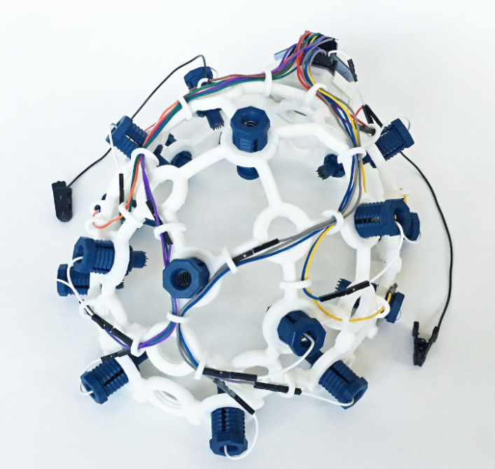
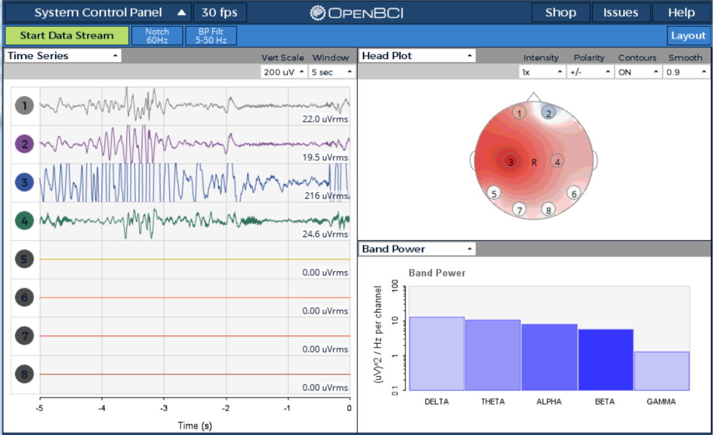
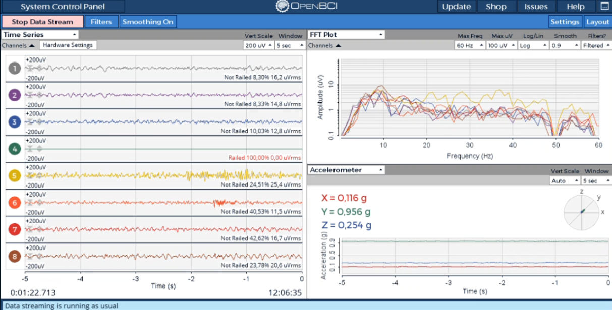
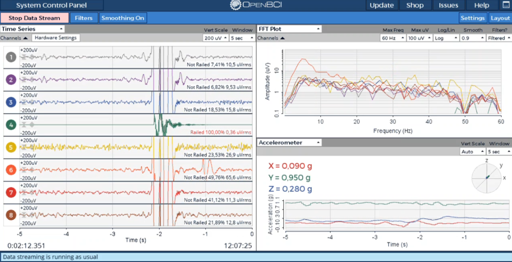
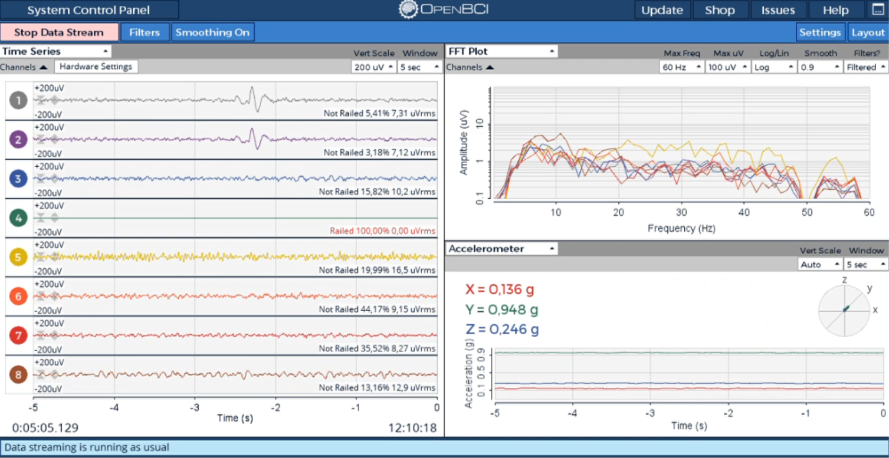
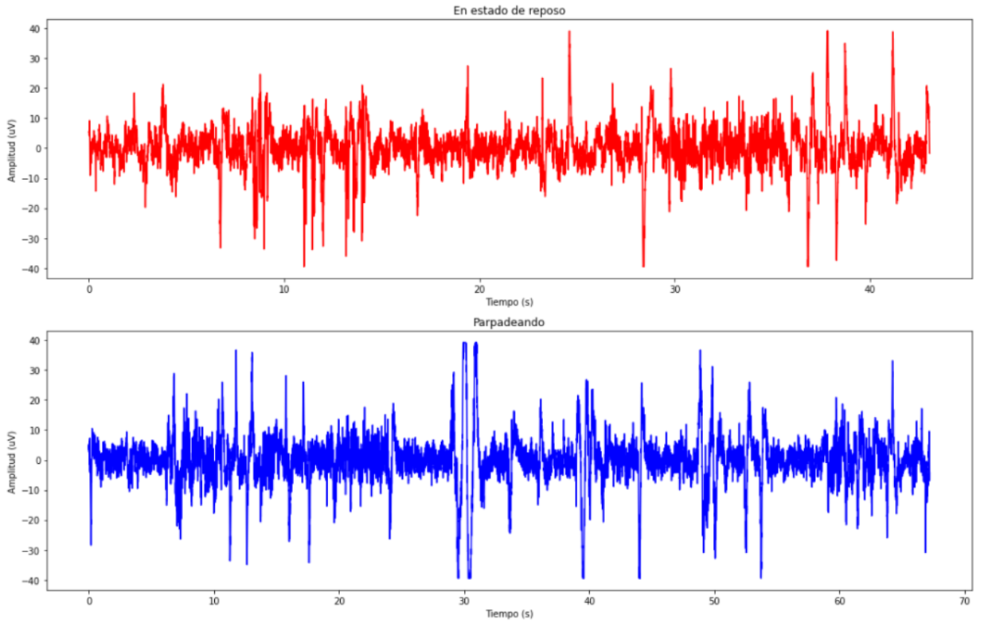
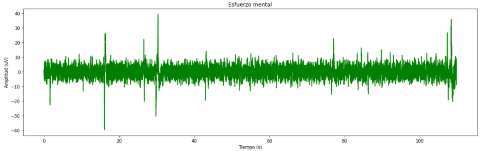
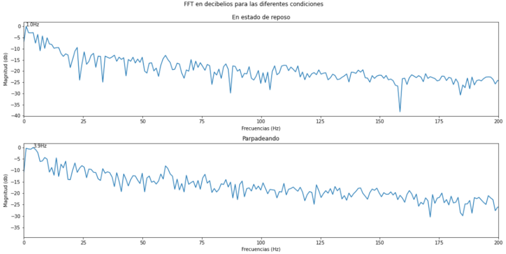
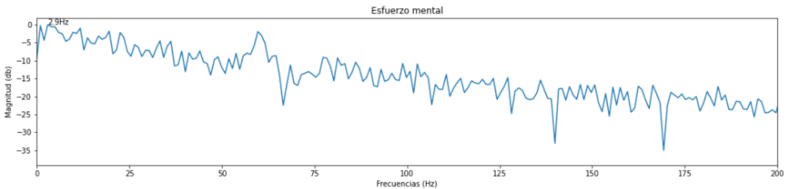

<html>
  <head>
    <meta content="text/html; charset=UTF-8" http-equiv="content-type" />
  </head>
  <body class="c23 doc-content">

# **Tabla de contenidos**
1. [Introducción](#id0)
2. [Objetivos](#id1)
3. [Materiales y equipos](#id2)
4. [Procedimiento](#id3)
5. [Conclusiones](#id4)
6. [Referencias](#id5)

<h2 class="c17">Introducci&oacute;n:</h2>

  En el ámbito de la investigación biomédica, la adquisición de señales del tipo Electroencefalograma (EEG) desempeña un papel fundamental en el estudio de la actividad cerebral. En este informe de laboratorio, abordaremos la adquisición de señales EEG utilizando dos métodos distintos: el módulo Bitalino y el ultracortex de OpenGUI. 

El UltraCortex "MARK IV" EEG HEADSET de OpenBCI por una parte, es un casco de EEG cómodo, ajustable e imprimible en 3D que es capaz de registrar la actividad cerebral (EEG) para un grado de investigación y puede muestrear hasta 16 canales de EEG de hasta 35 ubicaciones 10-20 diferentes. Utiliza sensores de EEG secos y es fácil de colocar. [1]

Por otro lado, la plataforma Bitalino se puede emplear en la adquisición de diversos datos fisiológicos, dentro de los que encontramos al EEG. Según la guía de uso de BITalino, para medir la actividad cerebral existen dos posibles técnicas de medición con sus electrodos. Una es la monopolar y la otra es la configuración bipolar. [2] En la presente práctica se uso esta última configuración.

En términos generales, estos métodos permiten la captura de señales eléctricas cerebrales, brindando información cuantificable de la actividad neural y abriendo nuevas oportunidades para la investigación y el diagnóstico médico.

<h2 class="c17">Objetivos:</h2>
<body>
    <ul>
        <li>Adquirir señales biomédicas de EEG.</li>
        <li>Hacer un correcto uso del Ultracortex.</li>
        <li>Extraer la información de la señal EEG con ayuda del software OpenSignals y representar la información de forma gráfica.</li>
    </ul>

<h2 class="c17">Materiales y equipos:</h2>
<body>
    <ul>
        <li>1 Kit BiTalino modelo (R)EVOLUTION
        <li>1 Ultracortex	modelo Mark IV	
        <li>1 Laptop o PC

<h2 class="c17">Procedimiento:</h2>

  ### Fotos de conexión usada en el UltraCortex

  
  ## Ploteo de la señal en OpenBCI GUI
  

  OpenBCI es una herramienta open-source diseñada enfocada en biosensores y neurociencia, cuyo objetivo es disminuir la barrera existente al mundo de la interfaz     computador cerebro, manteniendo la protección del consumidor de manera ética.[1]
  

  

  
  

  En nuestro laboratorio se llegó a colocar el Ultra Cortex en uno de los integrantes, pero debido a falta de tiempo y problemas de conexión con la laptop no se      llegó a observar la onda cerebral de nuestro compañero, debido a eso se presentará una idea de lo que se debió obtener en el laboratorio así como nuestra           interpretación.
  

  

  

  De las imágenes y videos vistos anteriormente se debió obtener la siguiente gráfica estando en diferentes estados, uno en reposo, el segundo parpadeando y por      último preguntas para realizar esfuerzo mental.
  

  

  

  

  

  
  

  Como se observa se usó la misma metodología para ambos casos, pero solo se ploteara la señal obtenida usando el Open Signals debido a los problemas mencionados     anteriormente.
  

  ### Fotos de conexión usada en el EEG
  

  ## Video de señal mostrando el punto 1,2 y 4 del procedimiento
  https://github.com/jaamiila/IntroSe-ales/blob/main/ISB/5.Adquisici%C3%B3n%20de%20EEG/toma%20de%20datos%20Bitalino.mp4
  
  ## Explicación de la señal ploteada
  

  *Paso 1*: Registro de la línea base (30 segundos)
  En este paso, se registra una señal de EEG en condiciones de reposo, sin movimiento y con una respiración normal. Esto proporciona una referencia de la actividad   cerebral en un estado de calma. En este período, esperaríamos ver una señal EEG relativamente estable y con poco ruido, con patrones de actividad cerebral          típicos en un estado de reposo.

  *Lo que se espera de este paso*:  En un estado de reposo, la señal EEG típicamente mostraría patrones de actividad cerebral relacionados con un cerebro en calma     y sin una actividad cognitiva o física significativa. Las características comunes de esta señal incluirían:

  Actividad Alfa: Durante los ojos cerrados y en un estado de reposo tranquilo, podríamos esperar ver una actividad alfa prominente en la señal EEG. La actividad     alfa se encuentra típicamente en el rango de frecuencia de 8-13 Hz y es indicativa de un estado relajado de la mente.

  Baja Amplitud: En este estado, la amplitud de la señal EEG sería relativamente baja, lo que significa que las oscilaciones de voltaje en la señal son suaves y no   muy pronunciadas.

  Poca Variabilidad: Habría poca variabilidad en la señal, ya que el cerebro no está involucrado en tareas cognitivas o físicas activas.

  *Lo que se obtuvo en los resultados*: Se puede observar en la imagen el ruido que existe como picos en la amplitud de la señal que se pueden interpretar como       interferencia por el movimiento, mala colocación de los electrodos, de igual forma la amplitud de la señal EEG sería relativamente baja, lo que significa que las   oscilaciones de voltaje en la señal son suaves y no muy pronunciadas.
  

  

  
 

 *Paso 2*: Ciclo de OJOS ABIERTOS - OJOS CERRADOS (5 repeticiones)
En este paso, se alterna entre períodos de ojos abiertos y ojos cerrados durante 5 segundos cada uno. Esto se hace repetidamente cinco veces. Durante la fase de ojos cerrados, es probable que veamos un aumento en la amplitud de la actividad alfa en el EEG, que es una característica típica de los patrones de descanso. Durante la fase de ojos abiertos, es probable que esta actividad alfa disminuya y veamos una mayor variabilidad en la señal debido a la entrada visual.[2][3][4]

*Lo que se espera de este paso*: Cuando parpadeas, es probable que veas una interrupción temporal en la señal EEG. Esto se debe a que el acto de parpadear puede causar un cambio en la impedancia entre los electrodos y la piel, lo que puede generar artefactos en la señal. Estos artefactos se manifestarían como picos o caídas bruscas en la señal EEG durante el parpadeo.[5]

Picos de Artefacto: Verías picos de artefacto en la señal EEG en el momento en que ocurre el parpadeo. Estos picos pueden ser temporales y de corta duración.

*Lo que se obtuvo en los resultados*: Se puede visualizar efectivamente mayores picos y momentos de amplitud alta constante por instantes de tiempo (Ojos abiertos de 5 seg). Además de los mencionados picos de artefacto en la señal EEG en el momento en que ocurre el parpadeo.

*Paso 3*: Registro de otra línea base de referencia (30 segundos)
Después de completar el ciclo de ojos abiertos y ojos cerrados, se registra nuevamente una línea base similar a la del Paso 1. Esto permite comparar la actividad cerebral después de la estimulación visual de los ojos abiertos con la actividad en reposo.

*Lo que se espera de este paso*: En un estado de reposo, la señal EEG típicamente mostraría patrones de actividad cerebral relacionados con un cerebro en calma y sin una actividad cognitiva o física significativa al igual que en el paso 1.
*Lo que se obtuvo en los resultados*: Resultado similar al paso 1.

*Paso 4*: Resolución de ejercicios matemáticos mientras se registra la señal EEG
En este paso, se le pide a un compañero que lea en voz alta una serie de ejercicios matemáticos, y el sujeto debe resolverlos mentalmente mientras se registra la señal EEG. Durante esta fase, podríamos observar cambios en la actividad cerebral asociados con el procesamiento cognitivo. Por ejemplo, podríamos ver un aumento en la actividad de las bandas de frecuencia beta, que están asociadas con la concentración y la actividad mental.[6]

*Lo que se espera de este paso*: Cuando una persona se encuentra en un estado de esfuerzo mental, como resolviendo problemas matemáticos mentalmente, podríamos esperar ver cambios en la señal EEG que reflejen la actividad cognitiva aumentada. Algunas de las características que podrían observarse incluyen:

Actividad Beta: Puede haber un aumento en la actividad de las ondas cerebrales beta, que generalmente se encuentran en el rango de frecuencia de 13-30 Hz. Estas ondas están asociadas con la concentración y la actividad mental.[7]

Mayor Amplitud: La señal EEG podría tener una amplitud más alta en comparación con el estado de reposo, ya que el cerebro está más activo.

Eventuales Cambios en Otras Frecuencias: Dependiendo de la tarea y el nivel de esfuerzo mental, podrían observarse cambios en otras frecuencias, como las ondas theta o gamma, pero esto variaría según la tarea específica y la persona.

*Lo que se obtuvo en los resultados*: A contraposición de las expectativas previas, es posible observar que durante el ejercicio mental, la señal de EEG exhibe una relativa estabilidad con una mínima interferencia de ruido, acompañada de ocasionales picos aislados, lo cual refleja patrones de actividad cerebral típicos asociados con un estado de reposo. Este hallazgo contrasta notablemente con las suposiciones iniciales. No obstante, cabe destacar que se observa la presencia de ondas notablemente cercanas entre sí, configurando una estructura compacta en el centro del trazado. En este contexto, podríamos describir esta señal como caracterizada por una "concentración de picos" o una "agrupación densa de oscilaciones", lo que sugiere que las fluctuaciones en la señal están estrechamente relacionadas y se manifiestan como una entidad cohesiva en el gráfico.

*Paso 5*: Detener la grabación y guardar los datos
Finalmente, se detiene la grabación y se guardan los datos registrados para su posterior análisis.

  
## Ploteo de la señal en Python
  

  

  

  

  
<h2 class="c17">Conclusiones:</h2>

  <body>
    <ul>
        <li>Se consiguió obtener las señales encefalográficas con el uso del módulo de Bitalino.
        <li>Fue posible familiarizarnos con la colocación y uso del Ultracortex para que en futuras pruebas el procedimiento sea más rápido y los resultados sean óptimos.
        <li>El análisis de las señales EEG permitió identificar patrones característicos de la actividad cerebral .

</head>
<body>
  

    <h2>Referencias</h2>
    <ol start="1">
        <li>“Openbci at a glance”. OPENBCI. Accedido el 30 de septiembre de 2023. [En línea]. Disponible: <a href="https://openbci.com/about">https://openbci.com/about</a>.</li>
        <li>Ultracortex ‘Mark IV’ EEG headset (no date) OpenBCI Online Store. Available at: <a href="https://shop.openbci.com/products/ultracortex-mark-iv">https://shop.openbci.com/products/ultracortex-mark-iv</a> (Accessed: 01 October 2023).</li>
        <li>Support Plux Biosignals official – official plux support and biosignals ... (no date) HOME-GUIDE #3 ELECTROENCEPHALOGRAPHY (EEG) Exploring Brain Signals. Available at: <a href="https://support.pluxbiosignals.com/wp-content/uploads/2022/04/HomeGuide3_EEG.pdf">https://support.pluxbiosignals.com/wp-content/uploads/2022/04/HomeGuide3_EEG.pdf</a> (Accessed: 02 October 2023).</li>
        <li>R. Paprocki and A. Lenskiy, “What does eye-blink rate variability dynamics tell us about cognitive performance?,” Front. Hum. Neurosci., vol. 11, 2017.</li>
        <li>D. Dasari, G. Shou, and L. Ding, “ICA-derived EEG correlates to mental fatigue, effort, and workload in a realistically simulated air traffic control task,” Front. Neurosci., vol. 11, 2017.</li>
        <li>“Blink behaviour based drowsiness detection – method development and validation,” Diva-portal.org. [Online]. Available: <a href="https://www.diva-portal.org/smash/get/diva2:673983/FULLTEXT01.pdf">https://www.diva-portal.org/smash/get/diva2:673983/FULLTEXT01.pdf</a>. [Accessed: 02-Oct-2023].</li>
        <li>“Eye blinking as an indicator of fatigue and mental load – a systematic review,” Researchgate.net. [Online]. Available: <a href="https://www.researchgate.net/publication/277010972_Eye_blinking_as_an_indicator_of_fatigue_and_mental_load_-_a_systematic_review">https://www.researchgate.net/publication/277010972_Eye_blinking_as_an_indicator_of_fatigue_and_mental_load_-_a_systematic_review</a>. [Accessed: 02-Oct-2023].</li>
        <li>M. Haak, S. Bos, S. Panic, and L. J. M. Rothkrantz, “Detecting stress using eye blinks and brain activity from EEG signals,” Stevenbos.com. [Online]. Available: <a href="https://www.stevenbos.com/dl/publications/Detecting_Stress_Using_Eye_Blinks_And_Brain_Activity_From_EEG_Signals.pdf">https://www.stevenbos.com/dl/publications/Detecting_Stress_Using_Eye_Blinks_And_Brain_Activity_From_EEG_Signals.pdf</a>. [Accessed: 02-Oct-2023].</li>
        <li>M. K. Eckstein, B. Guerra-Carrillo, A. T. Miller Singley, and S. A. Bunge, “Beyond eye gaze: What else can eyetracking reveal about cognition and cognitive development?,” Dev. Cogn. Neurosci., vol. 25, pp. 69–91, 2017.</li>
    </ol>
</body>
</head>
