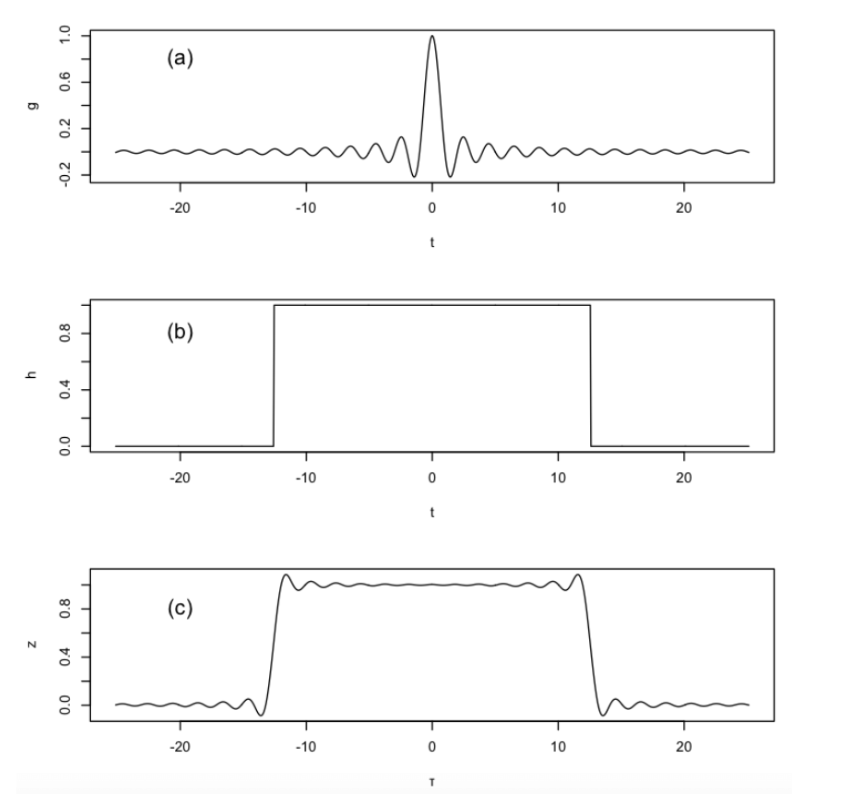
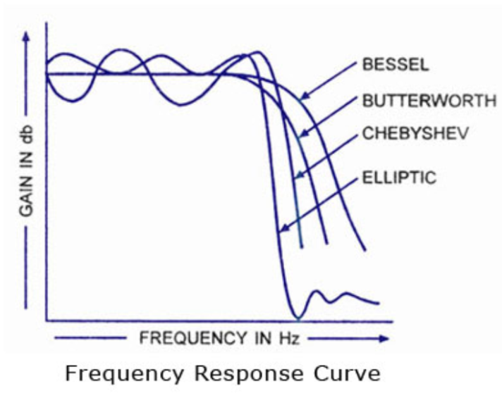
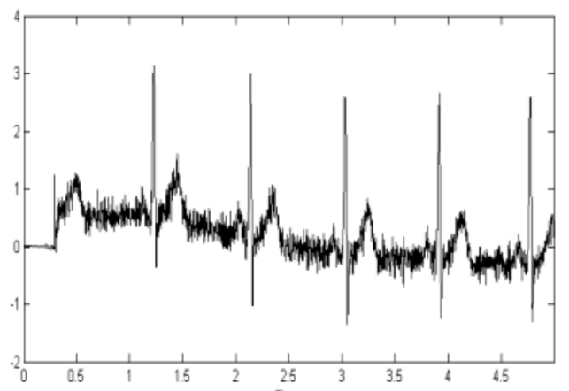
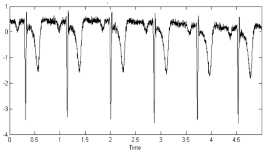
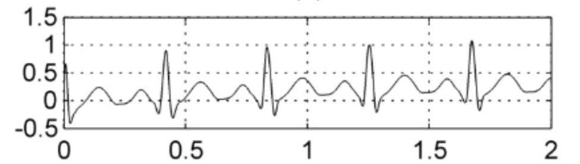

# Filtros IIR y FIR

### Laboratorio 6

#
## Objetivos
* Diseñar un filtro de tipo FIR usando el dataset de ECG obtenido el laboratorio pasado
* Diseñar un filtro de tipo IIR usando el dataset de ECG obtenido el laboratorio pasado 
* Presentar una tabla resumen comparando la señal cruda con la señal filtrada  

#

## Tabla de contenidos
1. Conceptos previos
    * Filtros digitales
      * Filtros FIR
      * Filtros IIR
2. Filtros en señal ECG
3. Filtros en señal EMG
3. Filtros en señal EMG

## Conceptos previos
Este informe tiene como objetivo mostrar el uso de diferentes filtros (FIR, IIR y DWT) en las señales de ECG, EMG y EEG adquiridas en clase. Los filtros son herramientas que permiten modificar una señal para eliminar o resaltar ciertas características de interés. En el caso de las señales bioeléctricas, como el ECG, EMG y EEG, los filtros son utilizados para eliminar el ruido y las interferencias que pueden afectar la calidad de la señal y dificultar su análisis. 

### Filtros digitales
Son una herramienta crucial en el procesamiento digital de señales (PDS). Estos filtros se utilizan para modificar o analizar las señales digitales, permitiendo separar o combinar ciertas frecuencias en una señal. Dentro de los filtros digitales tenemos tres tipos: Filtros de respuesta infinita al impulso, filtro de respuesta finita al impulso y filtros wavelet.

#### Filtros FIR
Los filtros FIR (Respuesta finita al impulso) son aquellos que tienen una respuesta al impulso de duración finita. Estos filtros son estables porque la sumatoria contiene una cantidad finita de elementos[1]. Los filtros FIR son ampliamente utilizados en el procesamiento de señales debido a su simplicidad y facilidad de implementación[2]. Los filtros FIR se pueden diseñar usando técnicas como la del ventaneo o el método de mínimos cuadrados. Las ventanas que se escogen para diseñar los filtros FIR pueden ayudar a mitigar en mayor o menor medida los efectos del fenómeno de Gibbs.

Figura 1. Ventana rectangular

#### Filtros IIR
Los filtros IIR (respuesta infinita al impulso) son sistemas causales que trabajan en tiempo real y tienen una respuesta de fase no lineal. El diseño de estos filtros se basa en la transformada Z, que permite representar la función de transferencia del filtro en el dominio Z. Los filtros IIR presentan una cantidad infinita de términos cuando se les aplica un impulso, lo que los hace más complejos que los filtros FIR. Los filtros IIR se utilizan en el procesamiento de señales bioeléctricas, como el ECG, EEG y EMG, para eliminar el ruido y las interferencias que pueden afectar la calidad de la señal y dificultar su análisis[3][4].

Los filtros IIR son utilizados en el procesamiento de señales bioeléctricas, como el EMG, para eliminar el ruido y las interferencias que pueden afectar la calidad de la señal y dificultar su análisis. Los tipos de filtros IIR más comunes son Butterworth, Chebyshev, Elliptic, Bessel y Causalidad. [1] El filtro Butterworth es un filtro de respuesta plana en la banda de paso y decae suavemente en la banda de rechazo.[2] El filtro Chebyshev presenta una respuesta de rizado en la banda de paso, pero tiene una pendiente más empinada en la banda de transición que el filtro Butterworth.[3][5] El filtro Elliptic presenta una respuesta de rizado tanto en la banda de paso como en la de rechazo, pero tiene la pendiente más empinada en la banda de transición. El filtro Bessel tiene una respuesta de fase lineal, lo que significa que no introduce distorsión en la señal de salida. El filtro de causalidad es un filtro IIR que solo utiliza valores pasados de la señal de entrada para calcular la salida, lo que lo hace útil en aplicaciones en tiempo real. En general, el tipo de filtro IIR utilizado en el procesamiento de señales bioeléctricas dependerá de las características específicas de la señal y de los requisitos de la aplicación.[4][5]

Figura 2. Tipos de filtros IRR

#### Filtros Wavelet
La transformada wavelet discreta (DWT) es una técnica de procesamiento de señales que permite analizar señales no estacionarias y detectar cambios abruptos en la señal. Las wavelets son señales que tienen una duración limitada y un valor promedio de cero. La DWT se obtiene al discretizar los parámetros de desplazamiento y escalamiento dentro de la transformada wavelet continua. Los coeficientes wavelet nos indican cuánta relación hay entre la señal y la wavelet madre, lo que nos permite conocer los componentes frecuenciales de la señal. La DWT se utiliza en el procesamiento de señales bioeléctricas, como el EMG, para extraer características de la señal y mejorar su análisis[4][5].

## Filtros en señal ECG
El uso de filtros es necesario para la obtención de una buena señal que sea fácil de interpretar, para eso debemos eliminar tanto ruidos instrumentales como captados erróneamente por el sensor. Para conocer qué es lo que debemos suprimir y que mantener necesitamos conocer unas características el ECG, como que su rango de frecuencia es de 0.5-100Hz, lo que lo vuelve una dificultad con ciertos ruidos, por ejemplo, las interferencias debido a las líneas eléctricas pueden ser muy significativo para la medición de eventos biomédicos, además del problema de que su ruido característico es a 50/60Hz, por lo que es necesario suprimir sin afectar las mediciones, para eso se pueden emplear filtros FIR, IIR y DWT[9][11][14].

Imagen 1. Señal ECG despues de pasar por un filtro FIR

Imagen 2. Señal ECG despues de pasar por un filtro IIR

Imagen 3. Señal ECG despues de pasar por un filtro DWT

Como se observa en las respectivas imágenes, después de pasar por sus respectivos filtros se puede notar sus respectivos efectos a la señal, algo a tener en cuenta es el desplazamiento obtenido por el filtro FIR debido a la naturaleza de este. Otra utilidad que se le puede dar al filtrado es para casos donde la enfermedad provoca alteraciones en esta de manera que no los confundamos debido al ruido, por ejemplo la apnea del sueño obstruida[12] donde debido a la falta de oxígeno se crea una diferencia entre las ondas, para el cual se pueden detectar mediante equipos y almacenarlos para  hacer una comparación, el problema es que en caso de que un ruido llegue a producir una falsa alerta puede crear desconfianza del funcionamiento del producto, además de provocarle problemas al paciente y a los asistentes.
Por lo que resumiendo, el filtrado es importante para una correcta interpretación de la señal evitando así falsas alarmas.

## Filtros en señal EMG
El uso de filtros FIR, IIR y DWT en el procesamiento de señales EMG puede tener diferentes efectos y aplicaciones. A continuación, se describen algunos aspectos relevantes de cada filtro:

- Efecto en la calidad de la señal: Los filtros FIR, IIR y DWT pueden mejorar la calidad de la señal EMG al eliminar el ruido y las interferencias que pueden afectar la señal. En particular, los filtros FIR y IIR se utilizan para eliminar el ruido de la señal, mientras que la DWT se utiliza para extraer características de la señal y mejorar su análisis[1][2][3].

- Eliminación de ruido e interferencias: Los filtros FIR, IIR y DWT se utilizan en el procesamiento de señales EMG para eliminar el ruido y las interferencias que pueden afectar la calidad de la señal y dificultar su análisis. En particular, los filtros FIR y IIR se utilizan para eliminar el ruido de la señal, mientras que la DWT se utiliza para extraer características de la señal y mejorar su análisis[4][5].

- Extracción de características: La DWT se utiliza en el procesamiento de señales EMG para extraer características de la señal y mejorar su análisis. En particular, la DWT permite analizar señales no estacionarias y detectar cambios abruptos en la señal, lo que puede ser útil para detectar patrones de fatiga muscular[3][5].

- Aplicaciones en diagnóstico y análisis: El procesamiento de señales EMG con filtros FIR, IIR y DWT puede tener diversas aplicaciones en el diagnóstico y análisis de patologías musculares. Por ejemplo, en el artículo "Diseño de un sistema para el análisis de señales dinámicas electromiográficas en estudios de ergonomía basado en técnicas temporales y frecuenciales"[4], se utiliza la DWT para extraer características de la señal EMG y estudiar la fatiga muscular. En el artículo "Mecanomiografía: desarrollo de un dispositivo para el monitoreo del límite de fatiga muscular"[5], se utiliza un filtro FIR para eliminar el ruido de la señal EMG y detectar el límite de fatiga muscular.

En conclusión, el uso de filtros FIR, IIR y DWT en el procesamiento de señales EMG puede mejorar la calidad de la señal, eliminar el ruido y las interferencias, extraer características de la señal y tener diversas aplicaciones en el diagnóstico y análisis de patologías musculares.

## Filtros en señal EEG
La aplicación de filtros a las señales EEG permite la eliminación de artefactos y el aislamiento de las características de interés por lo que es crucial su aplicación dentro de la etapa de procesamiento. Uno de los principales desafíos en el análisis de señales EEG es la presencia de artefactos generados por movimientos musculares o artefactos EMG. Estos artefactos pueden degradar significativamente la calidad de la señal y complicar el análisis computacional. [6] Para abordar este problema, se pueden aplicar varios tipos de filtros, incluyendo los filtros FIR, IIR y Wavelet. 

Los filtros FIR se destacan por su capacidad para minimizar los artefactos EMG en señales EEG contaminadas, ya que atenúan selectivamente las componentes de alta frecuencia y permiten una menor degradación de las ondas cerebrales. Además, se ha demostrado que las estructuras de filtro FIR modificadas con una conexión en cascada, twicing y sharpening, pueden mejorar la relación señal-ruido (SNR) en señales EEG simuladas. Los estudios también han demostrado que estas estructuras de filtro FIR modificadas superan a otros métodos propuestos para la atenuación de artefactos EMG, lo que respalda su eficacia en el filtrado de señales EEG.[6]

El filtrado IIR, por otro lado, ha sido sugerido en la literatura como una alternativa para atenuar los artefactos EMG. Sin embargo, es importante tener en cuenta que los filtros IIR pueden introducir distorsiones en la fase de la señal, lo que podría ser problemático en aplicaciones que requieran una alta fidelidad en la representación de la fase. [7]

Finalmente, los filtros Wavelet han demostrado ser eficaces en la eliminación de artefactos y la extracción de características relevantes en señales EEG, con la ventaja de que pueden adaptarse a las características temporales y de frecuencia de la señal. Los filtros Wavelet también se han utilizado con éxito en la clasificación de estados interictales y preictales en pacientes con epilepsia, lo que destaca su utilidad en aplicaciones clínicas. [8]

## Referencias
[1]	Smith, Julius, “Introduction to Digital Filters with Audio Applications”, 2007, W3K Publishing. [Accessed: 18-Oct-2023].

[2]	J. G. Proakis, D. G. Manolakis, and Pearson, Digital signal processing. Dorling Kindersley (India): Pearson, Cop, 2013.

[3]	T. de Grado Presentado por, “Acondicionamiento de Señales Bioeléctricas,” Core.ac.uk. [Online]. Available: https://core.ac.uk/download/pdf/71394319.pdf. [Accessed: 18-Oct-2023].

[4]	“Redes neuronales en la caracterización de señales bioeléctricas – acervo para el mejoramiento del aprendizaje de alumnos de ingeniería, en Inteligencia Artificial,” Unam.mx. [Online]. Available: https://virtual.cuautitlan.unam.mx/intar/?page_id=977. [Accessed: 18-Oct-2023].

[5]	A. V. Oppenheim and R. W. Schafer, Discrete-time signal processing. New York, Ny: Peason, 2013.

[6]	P. K. Sadasivan and D. N. Dutt, “Use of finite wordlength FIR digital filter structures with improved magnitude and phase characteristics for reduction of muscle noise in EEG signals,” Medical &amp; Biological Engineering &amp; Computing, vol. 33, no. 3. Springer Science and Business Media LLC, pp. 306–312, May 1995. doi: 10.1007/bf02510504.

[7]  S. M. Usman, S. Khalid, R. Akhtar, Z. Bortolotto, Z. Bashir, and H. Qiu, “Using scalp EEG and intracranial EEG signals for predicting epileptic seizures: Review of available methodologies,” Seizure, vol. 71. Elsevier BV, pp. 258–269, Oct. 2019. doi: 10.1016/j.seizure.2019.08.006.

[8]   H. Ocak, “Automatic detection of epileptic seizures in EEG using discrete wavelet transform and approximate entropy,” Expert Systems with Applications, vol. 36, no. 2. Elsevier BV, pp. 2027–2036, Mar. 2009. doi: 10.1016/j.eswa.2007.12.065.

[9] G. Kadam y P. Bhaskar, “REDUCTION OF POWER LINE INTERFERENCE IN ECG SIGNAL USING FIR FILTER”, Int. J. Comput. Eng. Res., vol. 2, n.º 2, pp. 314–319, 2012. Accedido el 18 de octubre de 2023. [En línea]. Disponible: https://www.researchgate.net/profile/Bhaskar-C/publication/252068169_REDUCTION_OF_POWER_LINE_INTERFERENCE_IN_ECG_SIGNAL_USING_FIR_FILTER/links/592286a5aca27295a8a648a3/REDUCTION-OF-POWER-LINE-INTERFERENCE-IN-ECG-SIGNAL-USING-FIR-FILTER.pdf

[10] M. Chavan, “Design and implementation of Digital FIR Equiripple Notch Filter on ECG Signal for removal of Power line Interference”, WSEAS TRANS. SIGNAL PROCESS., vol. 4, n.º 4, pp. 221–230, 2008. Accedido el 18 de octubre de 2023. [En línea]. Disponible: https://www.researchgate.net/profile/Mahadev-Uplane/publication/228346300_Design_and_implementation_of_digital_FIR_equiripple_notch_filter_on_ECG_signal_for_removal_of_power_line_interference/links/00b7d51a4e01547974000000/Design-and-implementation-of-digital-FIR-equiripple-notch-filter-on-ECG-signal-for-removal-of-power-line-interference.pdf

[11] “Suppression of Baseline Wander and power line interference in ECG using Digital IIR Filter”, INT. J. CIRCUITS, SYST. SIGNAL PROCESS., vol. 2, n.º 2, pp. 356–365, 2008. Accedido el 18 de octubre de 2023. [En línea]. Disponible: https://n9.cl/fgze1

[12] “Application of an optimal class of antisymmetric wavelet filter banks for obstructive sleep apnea diagnosis using ECG signals”, Comput. Biol. Medicine, vol. 100, pp. 100–113, septiembre de 2018. Accedido el 19 de octubre de 2023. [En línea]. Disponible: https://doi.org/10.1016/j.compbiomed.2018.06.011

[13] A. Daamouche y L. Hamami, “A wavelet optimization approach for ECG signal classification”, Biomed. Signal Process. Control, vol. 7, n.º 4, pp. 342–349, 2012. Accedido el 19 de octubre de 2023. [En línea]. Disponible: https://doi.org/10.1016/j.bspc.2011.07.001

[6] B. Rodrigues y M. Aparecido, “A wavelet-based method for power-line interference removal in ECG signals”, Res. Biomed. Eng., vol. 34, n.º 1, pp. 73–86, 2018. Accedido el 19 de octubre de 2023. [En línea]. Disponible: https://doi.org/10.1590/2446-4740.01817
