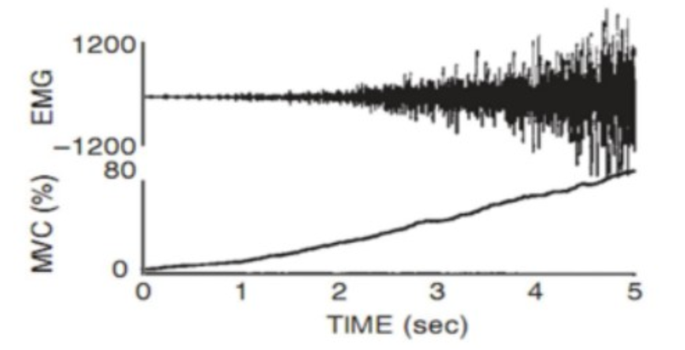

# Analisis de EMG

## Objetivos
* Identificar y medir características relevantes en señales EMG, tanto en el dominio del tiempo como en el de la frecuencia.
* Comparar la calidad de las características que se pueden extraer de una señal EMG después de ser filtrada por diferentes técnicas (FIR, IIR y Wavelet), con el fin de determinar cuál es la más adecuada para aplicaciones específicas.
* Relacionar lo aprendido con aplicaciones clínicas donde este tipo de procesamiento tiene una utilidad práctica, como en el diagnóstico de trastornos neuromusculares o en investigaciones relacionadas con la biomecánica.

## Tabla de contenidos
1. Introduccion
2. Resultados de la adquision de caracteristicas del EMG
3. Discusion

## Introduccion
En el ámbito de las señales biomédicas, el análisis de señales electromiográficas (EMG) es esencial para el diagnóstico y tratamiento de trastornos neuromusculares. Después de adquirir y filtrar estas señales con la placa y software de Bitalino, la extracción de características relevantes es un paso crítico.

Para poder analizar las señales EMG, estas se pueden representar tanto en el dominio del tiempo como en el dominio de la frecuencia. El dominio del tiempo implica manipulaciones como rectificación y filtrado, mientras que el análisis de frecuencia revela aspectos más complejos, esenciales para diseñar amplificadores y filtros. Este análisis es particularmente útil en aplicaciones como la biorretroalimentación, la práctica clínica y la investigación [1]. En este trabajo, exploramos las principales características del análisis de frecuencia de señales EMG y su relevancia en diversos contextos médicos.

## Resultados de la adquision de caracteristicas del EMG

## Discusion
Las señales EMG son una importante fuente de información para el diagnóstico de trastornos neuromusculares, la detección de atrofias musculares, el análisis funcional de determinados músculos, etc, por ello, un adecuado procesamiento de estas señales y una selección  de algoritmos y métodos apropiados es fundamental para obtener características significativas que permitan realizar implementaciones de hardware o que conlleven a la toma de decisiones.[2] Un ejemplo de aplicación del uso señales EEG para realizar acciones a nivel de hardware es su uso en el control de prótesis de extremidades superiores con alimentación externa[3].

Figura 1. Relación entre la contracción muscular voluntaria y la señal electromiográfica

El análisis de la señal SEMG se basa en las características temporales, por lo general usando el valor de amplitud rectificado RMS. Sin embargo, las señales SEMG son muy complejas, aleatorias, no estacionarias, no lineales y no se generan por fenómenos periódicos[5]. Por lo tanto, el procesamiento de señales EMG es fundamental para la detección de fatiga muscular y la identificación de enfermedades neuromusculares en las personas[6]. Así mismo, las redes neuronales son apropiadas para resolver problemas de clasificación, en este caso la red PNN demostró una amplia eficiencia en cuanto a la velocidad de respuesta y sobre todo en el alto porcentaje de acierto en la discriminación de todas las categorías[7].

Las características a considerar en el procesamiento de señales EMG son fundamentales para comprender adecuadamente la naturaleza y características de la señal en cuestión. A continuación, se describen dos características importantes a considerar en el procesamiento de señales EMG:

- Media: La media es una medida estadística que se utiliza para calcular el valor promedio de una señal EMG. La media es importante porque proporciona información sobre la amplitud promedio de la señal EMG. La media se utiliza comúnmente en el procesamiento de señales EMG para eliminar el ruido de la señal y para normalizar la señal EMG para su comparación con otras señales EMG[8].

- RMS: El valor RMS (Root Mean Square) es una medida estadística que se utiliza para calcular la raíz cuadrada de la media de los cuadrados de los valores de la señal EMG. El valor RMS es importante porque proporciona información sobre la amplitud efectiva de la señal EMG. El valor RMS se utiliza comúnmente en el procesamiento de señales EMG para eliminar el ruido de la señal y para normalizar la señal EMG para su comparación con otras señales EMG[2].

La media y el valor RMS son dos características importantes a considerar en el procesamiento de señales EMG. La media se utiliza para calcular el valor promedio de una señal EMG, mientras que el valor RMS se utiliza para calcular la raíz cuadrada de la media de los cuadrados de los valores de la señal EMG. Ambas características son importantes para eliminar el ruido de la señal y para normalizar la señal EMG para su comparación con otras señales EMG.

### Ejemplos de aplicaciones de EMG en investigación
La importancia de esta práctica radica en su potencial para contribuir significativamente a las áreas de estudio del movimiento humano y el diagnóstico neuromuscular. Actualmente, la electromiografía de superficie (sEMG) desempeña un papel crucial en la investigación de la actividad muscular y en el diagnóstico clínico de trastornos neuromusculares. Casi todos los pacientes con quejas relacionadas con el sistema neuromuscular se someten a investigaciones clínicas de EMG.[9] En particular, el enfoque en el reclutamiento y el comportamiento de disparo de unidades motoras individuales (UM) durante contracciones musculares voluntarias es esencial en el ámbito de la neurofisiología clínica. [10] Por esta razón, la comprensión de cómo estas características se reflejan en el dominio de la frecuencia y el tiempo, es de gran relevancia.

## Referencias
[1] P. A. Mathieu and S. J. Sullivan, “Frequency characteristics of signals and instrumentation: Implication for EMG biofeedback studies,” Biofeedback and Self-Regulation, vol. 15, no. 4. Springer Science and Business Media LLC, pp. 335–352, Dec. 1990. doi: 10.1007/bf01000027.

[2]	L. Gila, A. Malanda, I. Rodríguez Carreño, J. Rodríguez Falces, y J. Navallas, “Métodos de procesamiento y análisis de señales electromiográficas”, An. Sist. Sanit. Navar., vol. 32, pp. 27–43, 2009.

[3]	J. Andrés, G. Pinzon, y L. E. Mendoza, “ADQUISICIÓN Y PROCESAMIENTO DE SEÑALES EMG PARA CONTROLAR MOVIMIENTO DE UN BRAZO HIDRAULICO ACQUISITION AND SIGNAL PROCESSING EMG TO CONTROL MOVEMENT OF A HYDRAULIC ARM”, Unirioja.es. [En línea]. Disponible en: https://dialnet.unirioja.es/descarga/articulo/4966249.pdf. [Consultado: 24-oct-2023].

[4] G. Orellana, J. Jacob, and C. Nilo, “FACULTAD DE INGENIERÍA ESCUELA DE INGENIERÍA CIVIL MECATRÓNICA DISEÑO E IMPLEMENTACIÓN DE SISTEMA PARA DETECCIÓN DE SEÑALES ELECTROMIOGRÁFICAS Memoria para optar al Título de Ingeniero Civil Mecatrónico Profesor Guía,” 2018. Available: http://dspace.utalca.cl/bitstream/1950/12299/3/tutcur-20180011.pdf

[5]	J. L. Correa-Figueroa, “Sistema de Adquisición de Señales SEMG para la Detección de Fatiga Muscular”, Org.mx. [En línea]. Disponible en: http://www.scielo.org.mx/scielo.php?pid=S0188-95322016000100017&script=sci_arttext. [Consultado: 24-oct-2023].

[6]	C. M. D. Acevedo, “Optimización y clasificación de señales EMG a través de métodos de reconocimiento de patrones”, Org.co. [En línea]. Disponible en: http://www.scielo.org.co/scielo.php?pid=S1692-17982013000100009&script=sci_arttext. [Consultado: 24-oct-2023].

[7]	M. A. Haberman, “Procesamiento de señales aplicado a dispositivos de ayuda para personas con discapacidades motoras”, Semanticscholar.org. [En línea]. Disponible en: https://pdfs.semanticscholar.org/ad97/e161c6928e85954183780148ebfdc11f9685.pdf. [Consultado: 24-oct-2023].

[8]	Á. M. Sanz, “PROCESADO AVANZADO DE SEÑAL EMG”, Uc3m.es. [En línea]. Disponible en: https://e-archivo.uc3m.es/bitstream/handle/10016/28105/TFG_Alvaro_Moreno_Sanz_2017.pdf?isAllowed=y&sequence=1. [Consultado: 24-oct-2023].

[9]  D. F. Stegeman, J. H. Blok, H. J. Hermens, and K. Roeleveld, “Surface EMG models: properties and applications,” Journal of Electromyography and Kinesiology, vol. 10, no. 5. Elsevier BV, pp. 313–326, Oct. 2000. doi: 10.1016/s1050-6411(00)00023-7.

[10] T. I. Arabadzhiev, V. G. Dimitrov, N. A. Dimitrova, and G. V. Dimitrov, “Interpretation of EMG integral or RMS and estimates of ‘neuromuscular efficiency’ can be misleading in fatiguing contraction,” Journal of Electromyography and Kinesiology, vol. 20, no. 2. Elsevier BV, pp. 223–232, Apr. 2010. doi: 10.1016/j.jelekin.2009.01.008.
