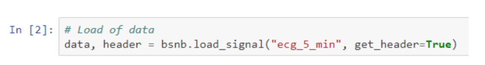
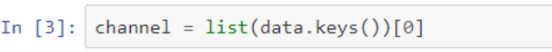
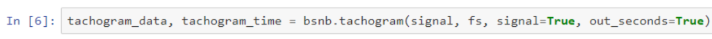
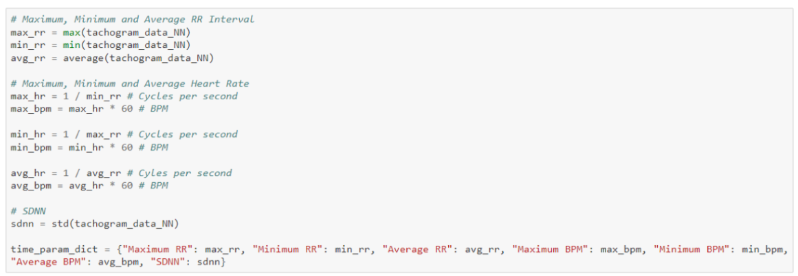
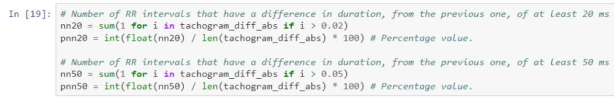
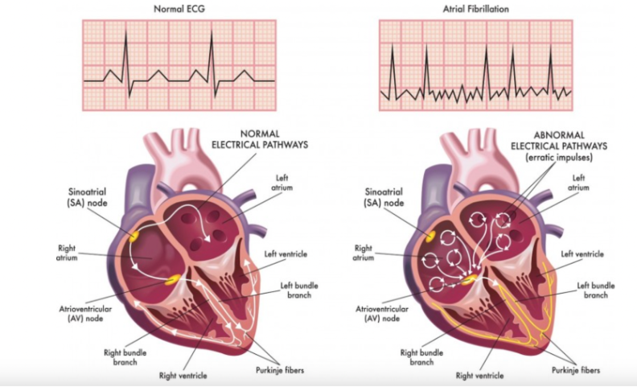
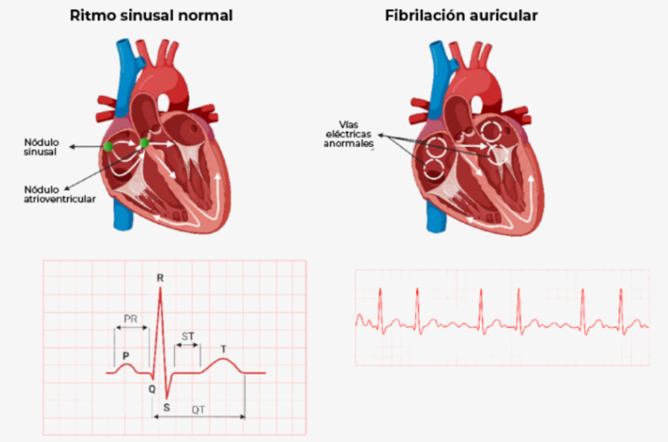
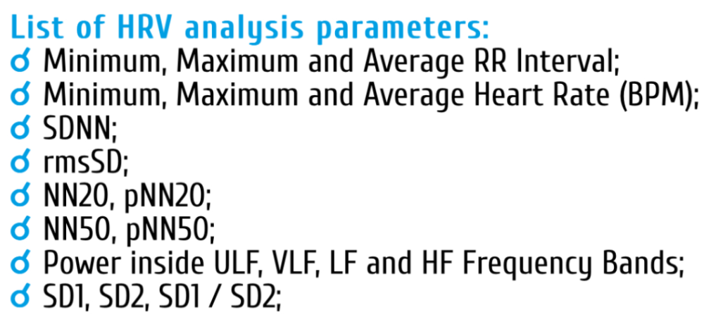

# Procesamiento de ECG

## Tabla de contenidos
1. Introduccion
2. Metodologia
3. Discusion de los resultados
4. Referencias
   
## Introducción:
El electrocardiograma estándar de 12 derivaciones es una herramienta fundamental en cardiología, pero a veces no proporciona suficiente información para un diagnóstico completo. El procesamiento y análisis de señales de ECG ofrecen la posibilidad de obtener información adicional valiosa a través de la extracción de características cardíacas y componentes de alta frecuencia para mejorar la precisión diagnóstica del ECG. Por ejemplo, extraer los HF-QRS tiene un gran potencial para mejorar el diagnóstico de condiciones cardíacas como la isquemia y el infarto. [1] Además, se ha estudiado la reducción de la complejidad de los datos para su uso en aprendizaje automático e inteligencia artificial en el ámbito de la salud digital. [2]

Este trabajo tiene como objetivo complementar estas investigaciones previas y abordar la importancia de la extracción precisa de características del ECG, incluyendo los intervalos RR, la frecuencia cardíaca, la variabilidad de la frecuencia cardíaca, y la evaluación de las componentes de alta frecuencia, ya que estas características desempeñan un papel crucial en la detección temprana de anomalías y enfermedades cardíacas.

## Metodología:
Para la obtención de parámetros importantes se usó como guía biosignals notebook[3], además de los códigos revisados en clase, estos recursos nos serán útiles para tratar las señales y extraer las características más importantes de las mismas. Para ese fin se decidió seguir los pasos:
1. Importación y carga: se procede a importar los paquetes necesarios para el desarrollo del programa y se carga el archivo ECG a evaluar.

Figura 1. Codigo para la importacion de datos

Como se observa se utiliza la librería otorgada por la página así como la numpy que sirve para la interpretación de los datos.

2. Información y almacenamiento: se busca determinar el canal utilizado para la adquisición y se almacena la frecuencia utilizada. El código utiliza la función bsnb.load, lo cual ingresando el archivo de datos obtenemos los datos y el cabezal.

Figura 2. Codigo para almacenamiento de datos

La función list nos sirve para la obtención del canal usado.

3. Generación del tacograma:  se define la estructura fundamental de los parámetros extraídos

Figura 3. Codigo para generacion del tacograma de datos

4. Eliminación de latidos cardíacos ectópicos: los latidos cardíacos ectópicos son cambios en los latidos cardíacos lo cual provoca latidos extras[4], sin embargo estos se consideran comunes pero deben ser suprimidos para la correcta interpretación de la señal.

5. Extracción de parámetros:
a) RR máximo y mínimo: se usan las funciones max y min para obtener dichos valores, lo que nos permite identificar en la señal los puntos R-R del ECG, los cuales se guardan con sus respectivos valores.

Figura 4. Codigo para extraccion de parametros

b) Visualización del espectro de frecuencias: una señal ECG tiene un espectro de frecuencias que va desde 0Hz hasta los 100Hz, por lo que debemos identificar las frecuencias presentes en los datos para poder filtrar los o deseados.

6. Obtención del NN20,pNN20,NN50 y pNN50: El NN20 es el número sucesivo de intervalos R-R que difieren en más de 20ms y el pNN20 es la proporcion de estos respecto al total de R-R, lo mismo para NN50, pero con respecto a 50ms[5]

Figura 5. Codigo para obtención del NN20,pNN20,NN50 y pNN50

## Discusión de resultados:

En cuanto a la discusión del presente trabajo, hemos determinado que la detección del complejo QRS es de suma importancia para realizar los diagnósticos necesarios para determinar las anomalías cardiacas. Primero definamos el Complejo QRS, el cual es denominado de esta manera porque es un registro del movimiento de los impulsos eléctricos, estos se manifiestan en las cavidades inferiores del corazón (ventrículos) [6]. De esta manera, el vector del complejo QRS puede dividirse en 3 derivadas diferentes entre sí [7]:
En primer lugar, un pequeño vector que se orienta hacia abajo y a la derecha, corresponde a la despolarización del tabique interventricular. En segundo lugar, los siguientes en despolarizarse son el ventrículo izquierdo y parte del ventrículo derecho; produciendo un gran vector que se dirige hacia abajo y a la izquierda. Por último, el último vector en despolarizarse es la parte basal del ventrículo derecho, generando un pequeño vector que se dirige hacia atrás, hacia arriba y a la derecha.

Figura 6. Distribución impulso cardíaco de Normal y Anormal EKG [8]

Figura 7. Ritmo sinusal, Fibrilación auricular y ondas e intervalos del electrocardiograma PQRS [9]

Debido a la importancia del Complejo QRS, la búsqueda de innovadores modelos y algoritmos matemáticos para su detección es fundamental. Asimismo, el algoritmo que se utiliza en el laboratorio está basado en un análisis digital de pendiente, amplitud y ancho exhaustivo, para el reconocimiento de este conjunto de ondas. Para detallar los pasos que acompañan a este algoritmo, se priorizará minimizar las erróneas detecciones ocasionadas por diferentes tipos de interferencia que se encuentran presentes en la señal de ondas; por este motivo,es determinante el uso previo de un filtro pasabandas porque también apoya el uso de umbrales de incidencia baja para el crecimiento de la sensibilidad de detección. De este modo, el algoritmo se ajusta de forma automática a los umbrales y parámetros que se registran de forma periódica para su adaptación frente a las diversas transformaciones que puede ser objeto de ECG como la morfología QRS y la frecuencia cardíaca.

Ahora explicaremos los parámetros de análisis de variabilidad de la frecuencia cardíaca (VFC).

Figura 8. Según “ECG Analysis - Heart Rate Variability Parameters” [10]

El ECG se puede utilizar para medir el intervalo RR, que es el tiempo entre dos ondas R consecutivas en un ECG. El intervalo RR es uno de los parámetros utilizados para medir la VFC, por lo que el electrocardiograma puede proporcionar indirectamente información sobre la VFC.

Estos parámetros se utilizan para medir la variación en el tiempo entre latidos consecutivos. La VFC se puede medir en el dominio del tiempo o de la frecuencia[9]. Estos son algunos de los parámetros de análisis de la VFC:

- Minimum, Maximum and Average RR Interval: El intervalo RR es el tiempo entre dos ondas R consecutivas en un ECG. Los intervalos RR mínimo, máximo y promedio son medidas de la variabilidad en el tiempo entre latidos.

- Minimum, Maximum and Average Heart Rate (BPM): Estos parámetros son medidas de la variabilidad de la frecuencia cardíaca.

- SDNN: Desviación estándar de los intervalos normal a normal (NN), que es una medida de la VFC general[12].

- rmsSD: La raíz cuadrática media de las diferencias sucesivas entre cada latido del corazón, que proporciona una medida confiable de la VFC y la actividad parasimpática [13].

- NN20, pN20: El número de pares de intervalos NN adyacentes que difieren en más de 20 ms, y la proporción de intervalos NN que difieren en más de 20 ms, respectivamente. Estos parámetros se utilizan para medir la VFC a corto plazo.

- NN50, pNN50: El número de pares de intervalos NN adyacentes que difieren en más de 50 ms, y la proporción de intervalos NN que difieren en más de 50 ms, respectivamente. Estos parámetros se utilizan para medir la VFC a largo plazo[12].

- Power inside ULF, VLF, Lf and HF Frequency Bands: Estos parámetros se utilizan para medir la potencia de la señal HRV en diferentes bandas de frecuencia[10].

- SD1, SD2, SD1 / SD2: Estos parámetros se derivan del gráfico de Poincaré, que es una representación gráfica de la relación entre intervalos RR consecutivos. SD1 y SD2 son medidas de VFC a corto y largo plazo, respectivamente, y SD1/SD2 es una medida del equilibrio simpatovagal[11].

El análisis de la VFC se puede realizar utilizando diferentes métodos y es posible que los resultados de cada método no sean directamente comparables. Por lo tanto, es importante elegir el método adecuado para la investigación o trabajo que se realiza[13].

Como resultado, la señal que es obtenida por los cambios hechos por los filtros notch, pasabandas y pasaltos, es una muestra de señal que se caracteriza por tener una elevada amplitud (en mV) frente a las señales de reposo. Estos picos notorios en el complejo QRS son preservados luego de la etapa de filtración para luego ser detectados al instaurar los umbrales adaptativos para el ECG y poder especificar la pendiente de las ondas en el complejo QRS.

## Referencias:
[1] E. Trägårdh and T. T. Schlegel, “High‐frequency QRS electrocardiogram,” Clinical Physiology and Functional Imaging, vol. 27, no. 4. Wiley, pp. 197–204, Jun. 10, 2007. doi: 10.1111/j.1475-097x.2007.00738.x. 

[2] A. K. Singh and S. Krishnan, “ECG signal feature extraction trends in methods and applications,” BioMedical Engineering OnLine, vol. 22, no. 1. Springer Science and Business Media LLC, Mar. 08, 2023. doi: 10.1186/s12938-023-01075-1.

[3] ECG analysis - heart rate variability parameters. (s.f.). Biosignals Notebook. http://notebooks.pluxbiosignals.com/notebooks/Categories/Extract/hrv_parameters_rev.html

[4]Latidos cardíacos ectópicos. (2022, 8 de mayo). MedlinePlus - Health Information from the National Library of Medicine. https://medlineplus.gov/spanish/ency/article/001100.htm#:~:text=Los%20latidos%20cardíacos%20ectópicos%20son,Estos%20son%20comunes.

[5]“The pNNx files: re-examining a widely used heart rate variability measure.”British Cardiac Society(2002) : 378-380. doi:10.1136/heart.88.4.378.
https://www.ncbi.nlm.nih.gov/pmc/articles/PMC1767394/

[6] “Componentes e intervalos en un electrocardiograma (ECG)”, Cigna.com. [En línea]. Disponible en: https://www.cigna.com/es-us/knowledge-center/hw/componentes-e-intervalos-en-un-electrocardiograma-zm2308. [Consultado: 30-oct-2023].

[7] SEIC, “Complejo QRS”, Ecocardio.com. [En línea]. Disponible en: https://ecocardio.com/documentos/biblioteca-preguntas-basicas/preguntas-al-cardiologo/1046-complejo-qrs.html. [Consultado: 30-oct-2023].

[8] “TEMA 2. PATOLOGÍAS CARDIOCIRCULATORIAS EN UCI”, Salusplay.com. [En línea]. Disponible en: https://www.salusplay.com/apuntes/cuidados-intensivos-uci/tema-2-patologias-cardiocirculatorias-en-uci. [Consultado: 30-oct-2023].

[9] K. Colcha, “ESTUDIOS DE EVIDENCIA EN MUNDO REAL EN ANTICOAGULACIÓN DE FIBRILACIÓN AURICULAR - Vertismed Ecuador”, Vertismed Ecuador - Plataforma Médica Científica, 03-jul-2023.

[10] “Hrv_parameters”, Pluxbiosignals.com. [En línea]. Disponible en: http://notebooks.pluxbiosignals.com/notebooks/Categories/Extract/hrv_parameters_rev.html. [Consultado: 30-oct-2023].

[11] S. Sieciński, P. S. Kostka, y E. J. Tkacz, “Heart rate variability analysis on electrocardiograms, seismocardiograms and gyrocardiograms on healthy volunteers”, Sensors (Basel), vol. 20, núm. 16, p. 4522, 2020.

[12] F. Shaffer y J. P. Ginsberg, “An overview of heart rate variability metrics and norms”, Front. Public Health, vol. 5, 2017.

[13] B. Farnsworth, “Heart rate variability - how to analyze ECG data”, iMotions, 19-jul-2019.

[14] P. Kumar, A. K. Das, Prachita, y S. Halder, “Time-domain HRV analysis of ECG signal under different body postures”, Procedia Comput. Sci., vol. 167, pp. 1705–1710, 2020.

