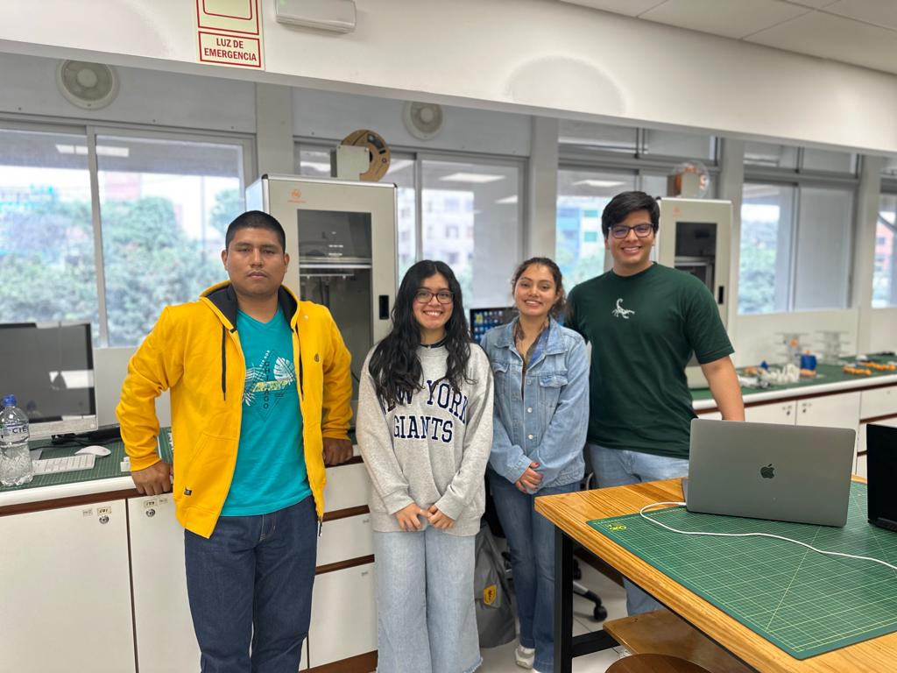

# Deteccion de convulsiones tonico-clonicas en niños con epilepsia
## Detection of tonic-clonic seizures in children with epilepsy

## Resumen
Las convulsiones tónico-clónicas son particularmente significativas en la epilepsia pediátrica; este tipo específico de convulsión necesita mecanismos de detección efectivos debido a sus riesgos inherentes. Nuestro proyecto propone un algoritmo de procesamiento de señales digitales para un dispositivo portátil y ligero para el monitoreo en tiempo real de las convulsiones tónico-clónicas en niños de 6 a 14 años. El algoritmo propuesto extrae las características más relevantes de una señal EEG y es capaz de contar cada episodio de convulsión durante el tiempo de monitoreo. Este proyecto tiene el potencial de mejorar los procesos de toma de decisiones de los profesionales de la salud, influyendo directamente y mejorando la calidad de vida de los pacientes y sus familias.

## Motivacion

## Principales Hallazgos
* Procesamiento de Datos:
  Se seleccionaron pacientes pediátricos con un alto número de episodios de epilepsia para mejorar la identificación de características en la señal EEG. Se aplicaron FFT y DWT a canales seleccionados, enfocándose en áreas como el lóbulo frontal lateral para obtener una localización más precisa de la actividad epileptogénica.

* Análisis de Frecuencia y Transformada Wavelet: Se utilizó FFT para descomponer la señal EEG en componentes de frecuencia, identificando la banda alfa y otros patrones relevantes. La Transformada Wavelet se aplicó para analizar cómo varían las frecuencias a lo largo del tiempo, ayudando a identificar convulsiones como eventos de alta energía en rangos de frecuencia específicos.

* Detección y Contabilización de Convulsiones: Se implementó un enfoque para contabilizar con precisión las convulsiones, considerando la variación temporal entre picos consecutivos. Esto ayudó a evitar la sobreestimación de episodios convulsivos y permitió una evaluación clínica más informada.

* Desafíos en la Adquisición de Señales EEG: Se enfrentaron obstáculos significativos en la adquisición de señales EEG en tiempo real, principalmente debido a problemas de conectividad y fallas en el hardware. Estas dificultades impactaron la comprobación del sistema de adquisición de señales EEG.

* Contribución al Tratamiento de la Epilepsia Pediátrica: A pesar de los desafíos, se desarrolló un algoritmo exitoso para la detección y contabilización de convulsiones, mejorando la comprensión de la distribución temporal de los episodios convulsivos y contribuyendo significativamente al campo de la epilepsia pediátrica y la medicina personalizada.

### ¿Quienes somos?

Somos estudiantes de la carrera de Ingenieria Biomedica de la Universidad Peruana Cayetano Heridia y Pontificia Universidad Catolica del Peru.

### Integrantes:
  * Jamila Vitella 
    
 Estudiante de octavo ciclo de Ingeniería Biomédica. Me considero responsable y creativa. Me gusta mucho la parte tecnológica de mi carrera ya que nos incentiva a ser más críticos e innovar a través de la ciencia. Me gustaria especializarme en el area de Ingenieria de Tejidos y Biomateriales.
  * Diego Romero
    
 Estudiante de octavo ciclo de Ingenieria Biomédica con gran admiración a la gestión de salud y futura especialización en Ingeniería Clínica. Me gustaria mejorar la calidad de vida de los pacientes en el sector público.
  * Claudia Zavaleta
    
 Estudiante de octavo ciclo de Ingeniería Biomédica con especial interés en el campo de Ingeniería de Tejidos y Biomateriales. Me considero una persona responsable y comprometida a mejorar el sistema de salud del país.

  * Eisel Pinado
    
 Estudiante de octavo ciclo de Ingenieria Biomédica con interes particular en el ámbito de Ingenieria Clinica. Me considero una persona enfocada a sus proyectos y de mente abierta a nuevas ideas.

    

### Docentes del curso
- Lewis de la Cruz - umbert.de.la.cruz@upch.pe
- Moises Meza - moises.meza@upch.pe
- José Alonso Cáceres - jo.alonsok@gmail.com
- Avid Roman - avid.roman.g@upch.pe

